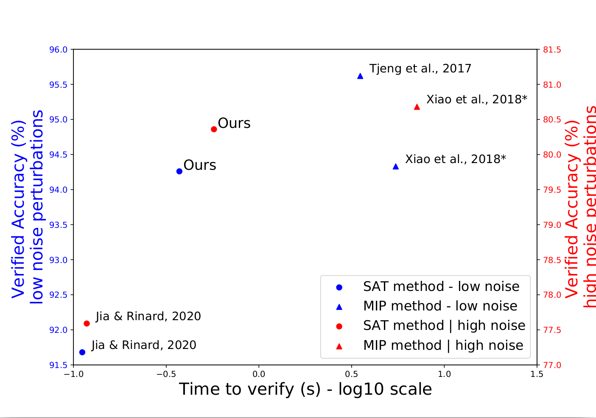
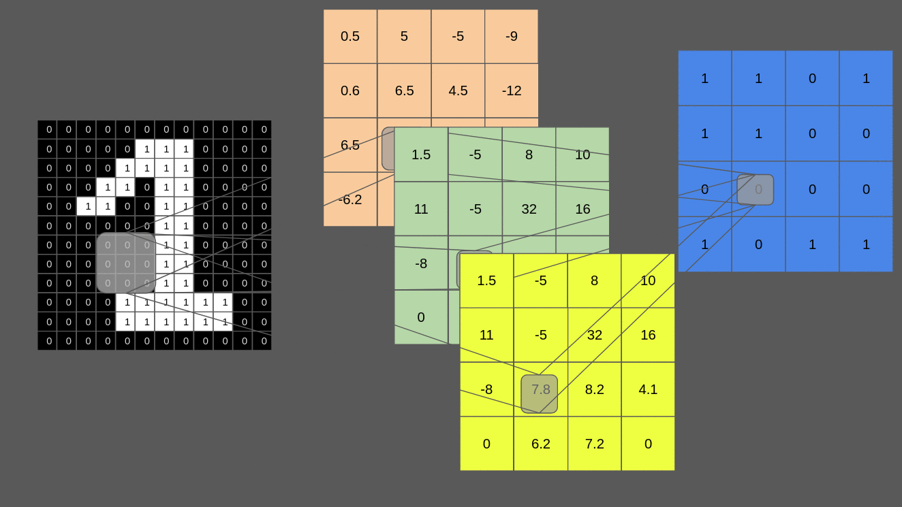

# TT-DCNN

This repository is the implementation Reproducibility part for submitted paper _Truth-Table Deep Convolutional Neural Network: A New Architecture Encodable By Design Into SAT Formulas_

With the expanding role of neural networks, the need for formal verification of their behavior and human post-processing has become critical. In the recent years, it was established that Binary Neural Networks (BNNs) have an equivalent representation in boolean logic and can be formally analyzed using logical reasoning tools such as SAT solvers. However, to date, only BNNs can be transformed into a SAT formula. In this work, we introduce Truth Table Deep Convolutional Neural Networks (TT-DCNNs), a new family of SAT-encodable models featuring for the first time real-valued weights. Furthermore, it admits, by construction, some valuable conversion features including post-tuning and tractability in the robustness verification setting. The latter property leads to a more compact SAT symbolic encoding than BNNs. This enables the use of a general SAT solver making property verification easier.  We demonstrate that TT-DCNNs outperform the verifiable accuracy of BNNs with a comparable computation time. This novel real-valued network has general applications and could constitute a practical response to the rising need for functional formal verification.




Our main contributions:

1. First, we define a new family of real-valued Deep Convolutional Neural Networks (DCNN) that can be encoded into SAT formulas: Truth Table Deep Convolutional Neural Network (TT-DCNN). Our TT-DCNN simplifies its 2D-CNN filter formulation in the form of a truth table to allow weights and certain intermediate values to be real. To the best of our knowledge, this is the first method to encode a real-valued DCNN into SAT, while achieving sufficient natural accuracy for practical use. 

2. TT-DCNNs offer two main valuable conversion properties over BNNs. 

(2-a: Post-tuning) The first one allows us to integrate human knowledge in the post-processing: we can now manually modify a DCNN filter activation towards a desired goal. For example, we decided to focus on reducing overfitting and, to this end, we characterize TT-DCNN logic rules resulting from overfitting and propose a filtering approach. The latter increases the verifiable accuracy without decreasing the natural accuracy: +0.43\% and +0.29\% for high noise MNIST and CIFAR10 respectively.

(2-b: Tractability) The second property enables to compute all possible model inputs/outputs prior to deployment in production. In an adversarial setting, we can assess whether the input noise will propagate to the output. We can therefore disregard filters with no impact on the output. This leads to a lower number of clauses and variables in the SAT formulas compared to BNNs, thus enabling the usage of generic SAT solver. When compared to the BNN/SAT method, our SAT formulas are 5 and 9 times more compact in terms of number of clauses for high noise MNIST and CIFAR10 respectively.

3. We apply our model to complete robustness verification. TT-DCNNs benefit from the synergy of the state-of-the-art of BNN/SAT method and that of real-valued DNN/MIP complete robustness verification methods. Our model improves the verifiable accuracy by more than 2.5\% for high noise MNIST and by 0.5\% for the high noise of CIFAR10 when compared to BNN/SAT method while decreasing the verification time by a factor of 9 for MNIST and 150 for CIFAR10 high noise when compared to MIP methods. 


Here is a visualisation of 1 block of 2D-CNN: the first layer has 3 filters with real-valued weigths and intermediate values, and the second layer has one filter with with real-valued weigths and  binary values.



## Building

The code needs python >= 3.7, and  has only been tested on Ubuntu 18.04.2 LTS. The
code is known to work with pytorch 1.5.0. Please insatll the requirements.


## Usage

The pretrained
models and truth tables can be downloaded [here](https://drive.google.com/drive/folders/1vso485OSVgIuCHxzmOK2hLAWCNHcCluR?usp=sharing).
This command is very memory comsumming, please make sure that you have at least 15GB of RAM free before starting the experiment.
To run the SAT solver verifier for the first 1K samples:

```

# verifying MNIST high noise without filtering
python3 evaluation_general_MNIST.py --attack_eps_ici 0.3 --modeltoeval normal --path_exp ../res_paper_final/mnist_high_noise/

# verifying MNIST high noise with filtering
python3 evaluation_general_MNIST.py --attack_eps_ici 0.3 --modeltoeval filtered --path_exp ../res_paper_final/mnist_high_noise/

# verifying CIFAR10 high noise without filtering
python3 evaluation_general_CIFAR10.py --attack_eps_ici 8 --modeltoeval normal --path_exp ../res_paper_final/cifar10_high_noise/

```


